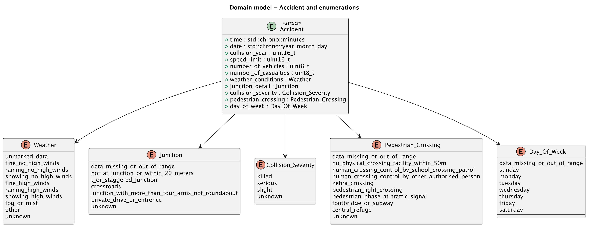
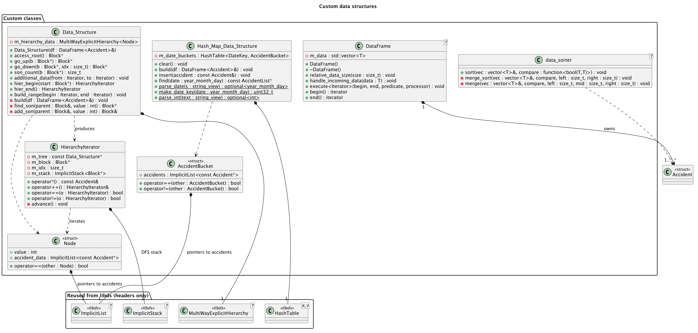
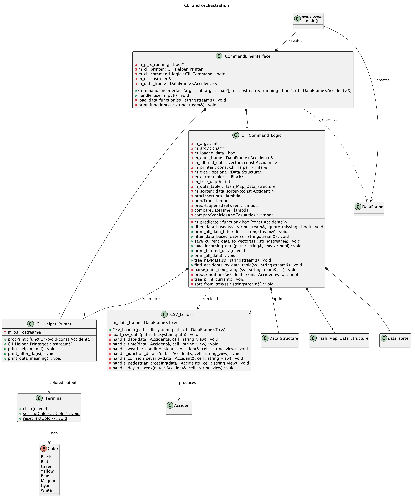
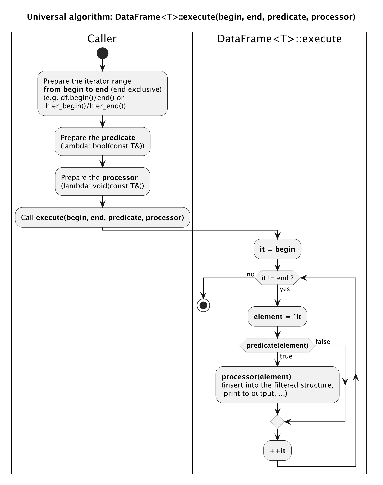
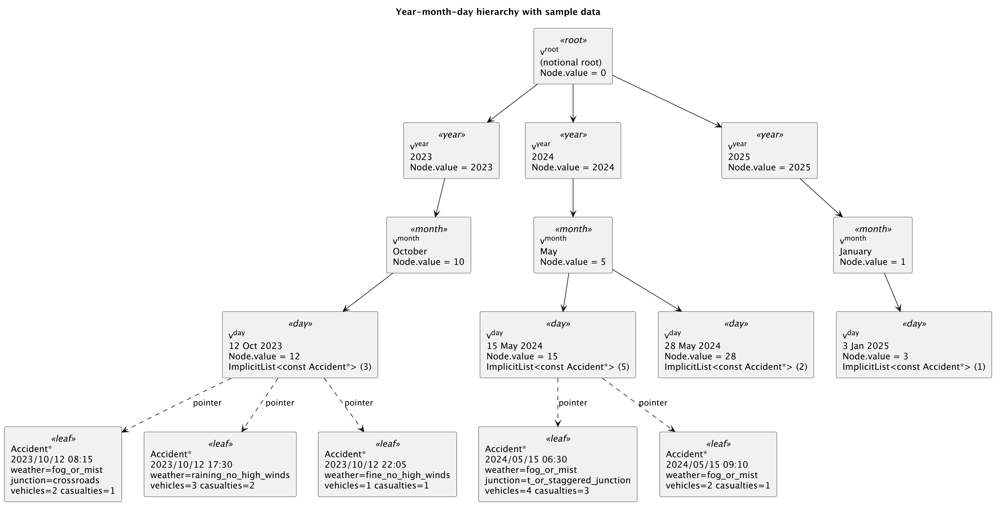
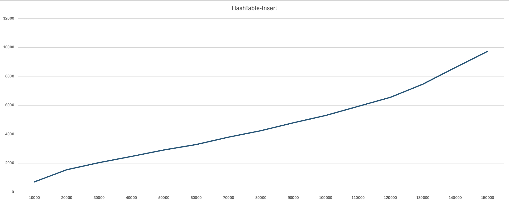
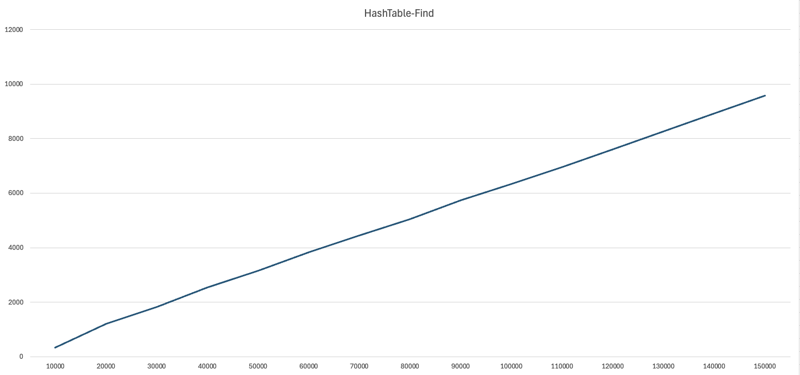

# Návrh aplikácie

Aplikácia spracováva údaje o dopravných nehodách vo Veľkej Británii (zdroj `gov.uk`) v štyroch funkčných úrovniach: sekvenčné filtrovanie záznamov, hierarchická navigácia podľa dátumu, rýchle vyhľadávanie cez hashovaciu tabuľku a univerzálne triedenie pomocou komparátorov. Všetky úrovne pracujú nad jednou raz načítanou primárnou údajovou štruktúrou. Vyššie úrovne držia len ukazovatele na záznamy z prvej úrovne, takže v aplikácii nedochádza k duplicite údajov.

Architektúra je rozdelená do troch vrstiev:

1. **Doménová vrstva** (`lib/structs/`): definuje záznam `Accident` a sadu vymenovaných (`enum class`) typov pre kategorické polia (počasie, križovatka, závažnosť, deň v týždni, priechod pre chodcov). Záznam je navrhnutý kompaktne (23 bajtov, primárne typy `uint8_t`, `uint16_t`, `std::chrono::year_month_day`, `std::chrono::minutes`), aby sa primárna postupnosť vošla do pamäte aj pre milióny záznamov.

2. **Vrstva údajových štruktúr** (`lib/data_strucutre/`, `libdf/data_handlers/`): obsahuje vlastné štruktúry postavené nad knižnicou `libds` z cvičení. Každá štruktúra rieši jednu úroveň semestrálnej práce a všetky operujú nad rovnakými dátami:
    - `DataFrame<T>`: sekvenčný kontajner pre úroveň 1 (vlastník záznamov),
    - `Data_Structure` + `HierarchyIterator`: viaccestná hierarchia rok–mesiac–deň pre úroveň 2,
    - `Hash_Map_Data_Structure` + `AccidentBucket`: hashovacia tabuľka s kľúčom dátumu pre úroveň 3,
    - `data_sorter<T>`: samostatný triediaci objekt s vnútorným MergeSort pre úroveň 4.

3. **CLI vrstva** (`lib/cli/`, `libdf/cli/`): interaktívna riadková aplikácia. `CommandLineInterface` číta vstup zo `stdin`, prvé slovo považuje za kľúčové slovo príkazu a zvyšok ako argumenty. Tieto sa delegujú do `Cli_Command_Logic`, ktorý vykonáva samotnú prácu (parsovanie filter flagov, držanie predikátu, beh univerzálneho algoritmu, navigácia hierarchiou, vyhľadanie v tabuľke, triedenie). Pomocná trieda `Cli_Helper_Printer` zoskupuje všetky pre používateľa viditeľné texty (nápoveda, popisy flagov, popisy enumov) a poskytuje procesor `procPrint` na formátovaný výpis záznamu.

Univerzálny algoritmus `DataFrame::execute(begin, end, predicate, processor)` je jedno spoločné jadro, ktoré sa volá zo všetkých štyroch úrovní. Pri filtre nad sekvenciou (U1) dostane jej iterátory; nad hierarchiou (U2) dostane `HierarchyIterator`; pri výpise utriedenej štruktúry (U4) dostane iterátory dočasného `std::vector`. Predikát aj procesor sa odovzdávajú ako `std::function`, takže jeden algoritmus zvládne všetky kombinácie bez akejkoľvek zmeny svojho tela.

## UML

Diagram tried je z dôvodu čitateľnosti rozdelený do troch logicky oddelených pohľadov. Použité štruktúry z knižnice `libds` sú v diagramoch zobrazené iba ako hlavičky tried v zmysle pravidiel SP. Plné PlantUML zdroje sa nachádzajú v priečinku `doc/semestral_project/img/`.

**Doménový model**: záznam `Accident` a vymenované typy:



**Údajové štruktúry**: `DataFrame`, `Data_Structure` (so závislosťami `Node`, `HierarchyIterator`), `Hash_Map_Data_Structure` (s `AccidentBucket`) a samostatný `data_sorter`. Sivé bloky napravo predstavujú prebraté triedy z `libds`:



**CLI a orchestrácia**: `Terminal`, `CSV_Loader`, `Cli_Helper_Printer`, `Cli_Command_Logic` a `CommandLineInterface`:




# Použité údajové štruktúry

V aplikácii sú použité vlastné triedy, ktoré zapuzdrujú jednu konkrétnu zodpovednosť (filtrovanie, hierarchická navigácia, hashovacie vyhľadávanie, triedenie), a interne stoja na prebratých štruktúrach z knižnice `libds` budovanej na cvičeniach. Záznamy o dopravných nehodách sú fyzicky uložené iba raz, v `DataFrame<Accident>`; všetky ostatné štruktúry držia výhradne ukazovatele (`const Accident*`) na tieto záznamy. Tým sa zachová podmienka zadania o neduplikácii údajov.

## Prebraté údajové štruktúry

Implementácia nasledujúcich údajových štruktúr je prebratá z cvičení (knižnica `libds`):

- `ds::amt::MultiWayExplicitHierarchy<T>`: explicitná viaccestná hierarchia, použitá ako úložisko stromu rok/mesiac/deň v `Data_Structure`.
- `ds::amt::MultiWayExplicitHierarchyBlock<T>`: blok (vrchol) hierarchie.
- `ds::adt::ImplicitList<T>`: postupnosť s implicitným poradím nad `ImplicitSequence`. Použitá na zoznam ukazovateľov v listoch hierarchie a v bunkách hashovacej tabuľky.
- `ds::adt::ImplicitStack<T>`: zásobník nad implicitnou postupnosťou, využitý v `HierarchyIterator` pri DFS prehliadke podstromu.
- `ds::adt::HashTable<K, V>`: tabuľka s rozptýlenými záznamami, ukazovatele na nehody adresované hashom dátumu.

## Štruktúra 1: DataFrame<T> (primárna postupnosť)

`DataFrame<T>` je tenký šablónový obal nad `std::vector<T>` s metódou `execute(begin, end, predicate, processor)`. Slúži ako vlastník všetkých načítaných záznamov. Použitie `std::vector` je v pravidlách SP pre úroveň 1 explicitne povolené (jediná štruktúra mimo `libds`, do ktorej sa údaje načítavajú).

Vhodnosť: pre úvodné načítanie a sekvenčné filtrovanie sa hodí priama (vektorová) postupnosť: `O(1)` amortizovaný `push_back` pri budovaní s predalokovanou kapacitou (`reserve`), `O(n)` priechod cez `begin()`/`end()`, dobrá lokalita pamäte a kompatibilita s univerzálnym algoritmom cez iterátory. Iné štruktúry (zoznam, hierarchia, tabuľka) by tu vyžadovali viac réžie bez zisku.

## Štruktúra 2: Data_Structure (hierarchia rok–mesiac–deň)

`Data_Structure` je obal nad `MultiWayExplicitHierarchy<Node>` z `libds`. Hierarchia má štyri úrovne: koreň -> rok -> mesiac -> deň. V každom liste (na úrovni dňa) je `ImplicitList<const Accident*>` s ukazovateľmi na záznamy z `DataFrame`. Trieda poskytuje navigačné operácie (`access_root`, `go_up`, `go_down`, `son_count`) a iterátor podstromu `HierarchyIterator`.

Vhodnosť: úroveň 2 vyžaduje logické členenie primárnej postupnosti podľa dátumových komponentov. Viaccestná hierarchia presne odráža relačný vzťah rok -> mesiac -> deň a umožňuje navigáciu po jednotlivých úrovniach v `O(1)` (pri prechode na rodiča). Pri vstavanom poradí riadkov v CSV (chronologicky) sa tým dosiahne aj lineárne načítavanie: po načítaní záznamu sa skontrolujú maximálne ostatné synovia na konci aktívnej vetvy.

`HierarchyIterator` je dopredný iterátor (`std::forward_iterator_tag`) so štandardnými typovými alias-mi (`value_type`, `reference`, `pointer`, `difference_type`). Interne udržiava zásobník (`ImplicitStack<Block*>`) blokov, ktoré ešte treba spracovať. Tento návrh splňuje požiadavku, aby iterátor bol samostatný objekt s vlastnými metódami, nie len lokálnym ukazovateľom na vrchol.

## Štruktúra 3: Hash_Map_Data_Structure (tabuľka)

`Hash_Map_Data_Structure` je obal nad `ds::adt::HashTable<DateKey, AccidentBucket>`, kde `DateKey = uint32_t` je dátum zakódovaný do tvaru `RRRR·10000 + MM·100 + DD` a `AccidentBucket` je obal nad `ImplicitList<const Accident*>`. Bunkový obal je potrebný, lebo `HashTable` v `libds` vyžaduje `operator==`/`operator!=` nad hodnotovým typom; `ImplicitList` ich nemá.

Vhodnosť: úroveň 3 vyžaduje efektívne vyhľadanie záznamov pre zadaný dátum. Hashovacia tabuľka poskytuje priemernú zložitosť `O(1)` pre `insert` aj `find`, čo je najlepšie možné pri tomto type dotazu. Sekvenčná utriedená tabuľka by si vyžadovala `O(log n)` cez binárne vyhľadávanie, BST/Treap rovnako. Pri niekoľkých rokoch a milióne záznamov je preto rozumná voľba hashovacia tabuľka. Duplicity sa neriešia kolíziami v tabuľke (pre rôzne dátumy by sa hashovacia funkcia rozptýlila normálne), ale na úrovni bunky: všetky nehody s tým istým dátumom žijú v jednom `AccidentList`. Tým sa pri vkladaní nestratí žiadny záznam (požiadavka U3).

## Štruktúra 4: data_sorter<T> (triediaci objekt)

`data_sorter<T>` je samostatný šablónový triediaci objekt v dedikovanom hlavičkovom súbore `lib/data_strucutre/sorter/data_sorter.hpp`, ktorý nezávisí od žiadnej inej časti projektu (iba `<functional>` a `<vector>`). Implementuje rekurzívny top-down MergeSort s deterministickou zložitosťou `O(n log n)` aj v najhoršom prípade. Verejné API tvorí jediná metóda `sort(std::vector<T>& vec, std::function<bool(const T&, const T&)> compare)`.

Vhodnosť: zadanie U4 explicitne vylučuje selection sort, insertion sort, bubble sort a ich varianty, požaduje zložitosť lepšiu ako `O(n²)`. MergeSort splní oba body, navyše je stabilný (zachová vstupné poradie pre prvky s rovnakým kľúčom), čo je užitočné pri komparátore `compareDateTime`, ktorý môže mať rovnaký kľúč v nehodách v ten istý moment. Komparátor sa odovzdáva ako `std::function`, čím je možné meniť kritérium triedenia formou lambda funkcií bez akejkoľvek úpravy tela algoritmu.

V projekte je triediacou jednotkou `const Accident*`, takže pri triedení sa presúvajú len osembajtové ukazovatele, nie celé záznamy.


# Úrovne

## Úroveň 1

Univerzálny algoritmus je realizovaný metódou `DataFrame<T>::execute(Iterator begin, Iterator end, const std::function<bool(const T&)>& predicate, const std::function<void(const T&)>& processor)`. Algoritmus prejde rozsah `[begin, end]`, pre každý prvok vyhodnotí `predicate` a ak vráti `true`, zavolá nad ním `processor`. Predikát ani procesor nie sú v tele algoritmu nikde fixované, vstupy sú iterátory (nie konkrétna štruktúra): dedikovaný objekt, šablónový `Iterator`, predikát a procesor cez lambda funkcie a využiteľnosť aj pre výpis.

V triede `Cli_Command_Logic` sú definované tri predikáty a dva procesory (všetko lambda funkcie):

- `predTrue`: vždy `true`.
- `predHappenedBetween`: dátum a čas spadajú do zadaného intervalu.
- `predConditions`:  kombinovaná kontrola voliteľných parametrov: rok, rýchlostný limit, počet vozidiel (min, max), počet obetí (min, max), počasie, križovatka, závažnosť, priechod, deň v týždni.
- `procInsertInto`:  vloží ukazovateľ na záznam do `std::vector<const Accident*>` (vyfiltrovaná štruktúra).
- `procPrint`: vypíše záznam na štandardný výstup vo formátovanom tvare (z `Cli_Helper_Printer`).

UML aktivitný diagram univerzálneho algoritmu je v `doc/semestral_project/img/`:



Úpravy vstupných CSV súborov. Pôvodné súbory `gov.uk` neboli upravované obsahovo (počet riadkov ani stĺpcov ostal zachovaný). Jediná úprava bola prekonvertovanie znakovej sady z Windows-1252 na UTF-8. Žiadne hodnoty nehôd sa nestratili. Načítavajú sa stĺpce, ktorých názvy sú: `date`, `time`, `collision_year`, `number_of_vehicles`, `number_of_casualties`, `weather_conditions`, `junction_detail`, `collision_severity`, `speed_limit`, `pedestrian_crossing`, `day_of_week`: `CSV_Loader` ich vyhľadá podľa hlavičkového riadku, takže poradie stĺpcov vo vstupnom súbore nie je dôležité.

## Úroveň 2

Spôsob načítavania hierarchie. `Data_Structure` sa stavia z primárnej postupnosti `DataFrame<Accident>` v metóde `build()`. Predpokladá sa, že záznamy v `DataFrame` sú chronologicky zoradené (zachované z CSV, UK DTF dataset je dodávaný v tomto poradí). Vďaka tomu nie je nutné pri každom vkladaní hľadať existujúci uzol roka/mesiaca/dňa od koreňa: udržiava sa pointer na aktuálny `rok`/`mesiac`/`deň` blok a:

1. Pre nový záznam sa porovnajú komponenty dátumu s aktuálnymi blokmi.
2. Ak sa rok/mesiac/deň zhoduje, prejde sa rovno k vloženiu ukazovateľa do listu (deň).
3. Ak sa zhoduje rok a mesiac, ale líši sa deň, pripojí sa nový denný uzol pod aktuálny mesiac. Analogicky pre mesiac a rok.
4. Ukazovateľ `const Accident*` sa vloží do `ImplicitList` denného uzla v `O(1)`.

Týmto je celé načítanie v zložitosti `O(n)` s konštantným počtom kontrol na záznam a každý CSV riadok sa otvára iba raz (v `CSV_Loader`).

Vizualizácia hierarchie:



Iterátor podstromu `HierarchyIterator` je dopredný iterátor s vlastným stavom (`m_block`, `m_idx`, zásobník `m_stack`). Prechod do ďalšieho prvku robí metóda `advance()`, ktorá v DFS poradí prejde podstrom kým nenájde neprázdny list, alebo nevyčerpá zásobník. Vďaka štandardným `iterator_category` a typovým alias-om sa iterátor dá poslať priamo do univerzálneho algoritmu z úrovne 1 bez akejkoľvek úpravy.

## Úroveň 3

Použitá tabuľka. `Hash_Map_Data_Structure` je obal nad `ds::adt::HashTable<DateKey, AccidentBucket>` z knižnice `libds`. Implementácia tabuľky úspešne prešla zverejnenými testami (`./libds.tests/ds-tests --test Tests.HashTable`).

Kľúč, dátum sa pakuje do `uint32_t` cez funkciu `make_date_key(date) = year·10000 + month·100 + day`. Voľba kompaktného integerového kľúča umožňuje hashovaciu funkciu z `libds` priamo využiť (modulárny hash nad celým číslom) a vyhnúť sa nutnosti porovnávať komplexné objekty pri kolíziách.

Riešenie duplicít. V dátach typicky existuje viac nehôd s rovnakým dátumom. Pri vkladaní sa preto v metóde `insert(const Accident&)` najprv pokúsime nájsť bunku pre daný kľúč:

- Ak existuje, do jej `accidents` zoznamu sa pridá nový ukazovateľ. (Vloženie do `ImplicitList` je `O(1)` na konci.)
- Ak neexistuje, vytvorí sa nový `AccidentBucket` s jedným ukazovateľom a vloží sa do tabuľky.

Tým sa neprepisuje žiaden záznam, neuplatňuje sa kontrola unikátnosti kľúča (zachovaná efektivita `O(1)` priemerne) a každá nehoda zostane vyhľadateľná.

Analýza časovej zložitosti operácií `vlož` a `nájdi`.

*Návrh tabuľky v `libds`.* `ds::adt::HashTable` rieši kolízie zreťazením (separate chaining): primárna oblasť je pole `m` synonymických zoznamov a kľúč padne do zoznamu s indexom `hash(key) % m`. Počet primárnych slotov je konštanta `CAPACITY = 100` a tabuľka sa nikdy nerehashuje, `m` ostáva 100 počas celého behu. Faktor zaplnenia preto rastie lineárne s počtom rôznych kľúčov* $\alpha = n_{\text{kľúčov}} / m$.

| Operácia (všeobecne, `m` fixné) | Priemerný prípad | Najhorší prípad |
|---|---|---|
| `find(date)` | $O(1 + n/m)$ | $O(n)$ |
| `insert(accident)` | $O(1 + n/m)$ | $O(n)$ |

- `find` $= O(1 + \alpha)$. Spočíta sa hash ($O(1)$) a lineárne sa prejde synonymický zoznam príslušného slotu s priemernou dĺžkou $\alpha = n/m$. Keďže `m` je konštanta, asymptoticky ide o $O(n)$ v počte rôznych kľúčov.
- `insert` $= O(1 + \alpha)$. `UnsortedExplicitSequenceTable::insert` najprv overí neprítomnosť kľúča (`contains`, čo je ten istý lineárny prechod zoznamom ako `find`) a až potom vloží prvok na začiatok v $O(1)$. Vkladanie teda dedí lineárnu zložitosť vyhľadávania, opäť $O(n)$ pri rastúcom počte rôznych kľúčov.
- Najhorší prípad $O(n)$ nastane pri degenerovanom hashi, keď sa všetky kľúče zobrazia do jedného slotu a jeden synonymický zoznam má dĺžku `n`.

*Empirické meranie.* Správanie sme odmerali samostatným benchmarkom (`complexities/hash_map_analyzer`): pre každú veľkosť od 10 000 do 150 000 rôznych kľúčov sme spustili 200 behov a spriemerovali čas jednej operácie.





Namerané priemery potvrdzujú lineárny trend predpovedaný teóriou:

| Počet kľúčov | 10 000 | 50 000 | 100 000 | 150 000 | Rast |
|---|---|---|---|---|---|
| `insert` [ns] | 692 | 3 172 | 5 573 | 10 186 | 14,7× |
| `find` [ns] | 389 | 3 024 | 6 880 | 12 374 | 31,8× |

Pri 15-násobnom náraste počtu kľúčov vzrástol čas oboch operácií zhruba 15–32-násobne, teda lineárne, presne ako vyplýva z $O(1 + n/m)$ pri konštantnom `m`. (Tabuľka so zdvojnásobovaním kapacity by udržala $\alpha$ pod konštantou a krivka by ostala plochá, verzia z `libds` túto optimalizáciu nemá.)

*Dôsledok pre túto aplikáciu.* Kľúčom je dátum, takže počet rôznych kľúčov je ohraničený kalendárom, pre roky 2023–2025 je to najviac ~1 095 hodnôt, nezávisle od počtu nehôd (tých môžu byť milióny). Pri `m = 100` je teda $\alpha \approx 11$ a ostáva konštantné, ďalšie nehody v ten istý deň iba predĺžia zoznam v príslušnej bunke (`insertLast` v $O(1)$), nepridajú nový kľúč. Vyhľadanie `date_table` je preto pre reálne dáta prakticky $O(1)$ a fixná kapacita tu nie je obmedzením, lineárny rast z grafov nastáva len pri umelom scenári s rastúcim počtom unikátnych kľúčov (benchmark).

*Vplyv na načítavanie.* Tabuľka sa naplní raz, jedným prechodom `DataFrame` po vybudovaní hierarchie. Pri ohraničenom počte dátumových kľúčov je každé `insert` v $O(1)$ a celkové naplnenie v $O(n)$, takže pridanie tabuľky nemení lineárnu zložitosť načítavania z úrovne 2.

## Úroveň 4

Triediaci algoritmus. `data_sorter<T>::sort` je vlastná implementácia rekurzívneho top-down MergeSortu s deterministickou zložitosťou `O(n log n)`. Triedi sa `std::vector<const Accident*>` získaný univerzálnym algoritmom z úrovne 1 nad podhierarchiou aktuálneho vrcholu. Pri zlučovaní sa kopírujú iba ukazovatele (8 bajtov), nie celé záznamy.

Triedenie je možné nad podhierarchiou aktuálneho vrcholu z úrovne 2 (`Cli_Command_Logic::sort_from_tree`) spustiť dvoma komparátormi:

- `compareDateTime`: primárny kľúč je `Accident::date`, sekundárny `Accident::time`. Lambda funkcia má signatúru `bool(const Accident*, const Accident*)` a vracia `true` ak prvý záznam má skorší dátum/čas.
- `compareVehiclesAndCasualties`: primárny kľúč je `number_of_vehicles`, sekundárny `number_of_casualties`.

Oba komparátory sú definované ako lambda funkcie v privátnej časti `Cli_Command_Logic`. Algoritmus samotný ich preberá cez `std::function`, čo umožňuje pridať ďalší komparátor (napr. podľa závažnosti) bez akejkoľvek úpravy tela algoritmu.

Výpis utriedenej štruktúry. Po dotriedení sa nad utriedeným `std::vector` zavolá `DataFrame::execute(temp.begin(), temp.end(), predTrue, printWithKeys)`. Procesor `printWithKeys` predsadí pred každý záznam dvojicu hodnôt, podľa ktorých sa triedilo (napr. `[2024/05/12 06:30] ...` resp. `[V:3 C:2] ...`). Tým je splnená požiadavka zadania, aby boli vypísané údaje spolu s hodnotami, na základe ktorých boli triedené.


# Používateľská príručka

Aplikácia je textová interaktívna konzola. Spustí sa preložením cieľa `semestral_project` (napr. v `build`):

```
./semestral_project
```

Po spustení sa automaticky načítajú CSV súbory uvedené ako argumenty z príkazového riadku (ak boli zadané). Hlavná slučka číta jeden riadok zo `stdin` a prvé slovo považuje za príkaz.

## Prehľad príkazov

| Príkaz | Popis | Príklad |
|---|---|---|
| `help` | Vypíše dostupné príkazy. | `help` |
| `flags` | Vypíše dostupné filter flagy. | `flags` |
| `data_meaning` | Vypíše mapovanie hodnôt enumerácií. | `data_meaning` |
| `load <cesta>` | Načíta CSV súbor. | `load data/collisions-2023.csv` |
| `filter <flagy>` | Nastaví predikát podľa filter flagov. | `filter -w 7 -j 2 -v 3 *` |
| `print` | Spustí algoritmus s aktuálnym predikátom a vypíše zhody. | `print` |
| `print -d` | Vypíše naposledy uložený snímok (`save_data`). | `print -d` |
| `date <interval>` | Nastaví predikát na časový rozsah. | `date -T 15/05/2024 06:00 15/05/2024 10:00` |
| `save_data <flagy>` | Spustí algoritmus s `procInsertInto`, uloží zhody do `m_filtered_data` a vypíše ich. | `save_data -T 12/03/2023 -w 1 -a 1 -j 3` |
| `date_table <DD/MM/RRRR>` | Vyhľadá záznamy v hashovacej tabuľke pre daný deň. | `date_table 12/10/2023` |
| `tree ls` | Vypíše synov aktuálneho vrcholu hierarchie. | `tree ls` |
| `tree down <i>` | Zostúpi na syna s indexom `i`. | `tree down 0` |
| `tree up` | Vystúpi na rodiča. | `tree up` |
| `tree root` | Skočí na koreň hierarchie. | `tree root` |
| `tree print [flagy]` | Vyfiltruje a vypíše záznamy v podhierarchii. | `tree print -w 7` |
| `tree filter <flagy>` | Nastaví predikát z filter flagov a vypíše zhody v podhierarchii aktuálneho vrcholu. | `tree filter -T 7:00 8:00` |
| `tree save_data [flagy]` | Uloží do `m_filtered_data` zhody z podhierarchie. | `tree save_data -j 2` |
| `tree sort 1 [flagy]` | Vytriedi podhierarchiu podľa dátumu a času. | `tree sort 1 -w 7` |
| `tree sort 2 [flagy]` | Vytriedi podľa počtu vozidiel a obetí. | `tree sort 2` |
| `exit` | Ukončí aplikáciu (vyčistí pamäť). | `exit` |

## Filter flagy

Filter flagy slúžia ako vstup pre predikát `predConditions`. Ich úplný zoznam:

| Flag | Význam | Príklad |
|---|---|---|
| `-co N` | Rok kolízie. | `-co 2024` |
| `-l N` | Rýchlostný limit. | `-l 30` |
| `-v MIN [MAX]` | Počet vozidiel (rozsah; hviezdičkou `*` neohraničený). | `-v 2 5` · `-v * 5` |
| `-c MIN [MAX]` | Počet obetí (rozsah; `*` neohraničený). | `-c 1 3` · `-c 1 *` |
| `-w N` | Počasie (1–9, `data_meaning` ukáže význam). | `-w 7` (hmla) |
| `-j N` | Križovatka. | `-j 2` (T-križovatka) |
| `-a N` | Závažnosť. | `-a 1` (úmrtie) |
| `-p N` | Priechod pre chodcov. | `-p 13` (zebra) |
| `-d N` | Deň v týždni (1=nedeľa, 7=sobota). | `-d 6` |
| `-T <dátum> [čas] [dátum] [čas]` | Dátumovo-časový interval. Dátum je voliteľný: pri zadaní len času (`HH:MM`) sa časové okno uplatní na každý deň. | `-T 7:00 8:00` · `-T 15/05/2024 16:00 20/05/2024 20:00` |
| `reset` / `-df` | Resetuje predikát na "match all". | `filter reset` |

Hviezdička `*` (alebo vynechanie horného/dolného konca) označuje neohraničenú stranu intervalu pri numerických flagoch. Pri `-T` možno vynechať čas (predvolene `00:00`–`23:59`) a uviesť len jeden deň; rovnako možno vynechať dátum a zadať len čas (napr. `-T 7:00 8:00`) – časové okno sa potom uplatní na každý deň, čo je užitočné v strome, kde rok a mesiac určuje aktuálny vrchol.

## Typický scenár

1. `load data/dft-road-casualty-statistics-collision-2024.csv`: načítanie údajov.
2. `tree root` -> `tree ls` -> `tree down 0` (rok) -> `tree ls` -> `tree down 4` (5. mesiac): navigácia v hierarchii.
3. `tree filter -T 7:00 8:00`: v aktuálnom vrchole (máj 2024) vypíše len nehody, ktoré sa stali medzi 07:00 a 08:00 (časové okno bez dátumu).
4. `tree sort 1 -w 7 -j 2`: vytriedi nehody za hmly na T-križovatkách v máji 2024 podľa dátumu a času, výpis predsadí každý záznam časovou pečiatkou.
5. `date_table 12/10/2023`: okamžité vyhľadanie nehôd z presného dňa cez tabuľku.

## Ukončenie

Príkaz `exit` korektne uvoľní všetku pamäť. Aplikácia je linkovaná s `heap-monitor`, takže pri pravidelnom ukončení neostávajú memory leak-y.

# Programátorská príručka

Táto sekcia popisuje, ako rozšíriť aplikáciu o novú funkcionalitu bez toho, aby bolo treba zasahovať do tela univerzálneho algoritmu.

## Pridanie nového predikátu

Predikát je `std::function<bool(const Accident&)>`. Stačí ho zapísať ako lambda funkciu v `lib/cli/cli_commands_logic.hpp` v privátnej sekcii a v `Cli_Command_Logic` vyrobiť nový príkaz alebo flag, ktorý ho po nastavení parametrov uloží do `m_predicate`.


```cpp
const std::function<bool(const Accident&)> predHasCasualty =
    [](const Accident& a) { return a.number_of_casualties > 0; };
```

Použitie nového predikátu nevyžaduje žiadnu zmenu v `DataFrame::execute`: algoritmus pracuje cez `std::function<bool(const T&)>`, takže preberá ľubovoľné kompatibilné callable.

## Pridanie nového procesora

Procesor je `std::function<void(const Accident&)>` (resp. s kontextom `void(Container&, const Accident&)` ak potrebuje cieľovú štruktúru). V projekte sú dva základné procesory:

- `procPrint` v `Cli_Helper_Printer`: formátovaný výpis,
- `procInsertInto` v `Cli_Command_Logic`: vloženie do `std::vector<const Accident*>`.

Pridanie nového procesora (napr. zapisovať do `std::ofstream`):

```cpp
std::ofstream out("filtered.csv");
auto procToCsv = [&out](const Accident& a) {
    out << static_cast<int>(a.date.year()) << ','
        << static_cast<unsigned>(a.date.month()) << ','
        << static_cast<unsigned>(a.date.day()) << '\n';
};
m_data_frame.execute(m_data_frame.begin(), m_data_frame.end(),
                     m_predicate, procToCsv);
```

## Pridanie nového komparátora pre triedenie

Komparátor pre `data_sorter<const Accident*>` má signatúru `bool(const Accident*, const Accident*)`. Algoritmus ho preberá cez `std::function`, takže stačí napísať novú lambda funkciu v `Cli_Command_Logic` a obslúžiť ju v `sort_from_tree`. Príklad: triedenie podľa závažnosti, sekundárne podľa počtu obetí:

```cpp
const std::function<bool(const Accident*, const Accident*)> compareSeverity =
    [](const Accident* a, const Accident* b) {
        if (a->collision_severity != b->collision_severity)
            return static_cast<int>(a->collision_severity) <
                   static_cast<int>(b->collision_severity);
        return a->number_of_casualties > b->number_of_casualties;
    };
```

Telo `data_sorter<T>::sort` nie je potrebné modifikovať.

## Pridanie nového typu prehliadky hierarchie

`HierarchyIterator` je dopredný iterátor, ktorý prechádza listy v DFS pre-order poradí. Ak by bolo treba iný typ prehliadky (napr. BFS, alebo iba synovia bez rekurzie do podstromu), je potrebné implementovať vlastný iterátor splňujúci rovnaké rozhranie (typové alias-y `value_type`, `reference`, `pointer`, `difference_type`, `iterator_category`, operátory `*`, `++`, `==`, `!=`). Vďaka šablónovému parametru `Iterator` v `DataFrame::execute` sa potom dá použiť bez zmeny algoritmu.

## Rozšírenie záznamu Accident

Ak by bolo treba pridať nové pole (napr. okres, mapové súradnice), kroky sú:

1. Pridať dátový člen do `struct Accident` v `lib/structs/accident.hpp`.
2. V `CSV_Loader<T>::load_csv_data` doplniť názov stĺpca do mapy `mapa`.
3. Pridať príslušnú `handle_*` metódu (predloha v existujúcich `handle_weather_conditions` a pod.).
4. Voliteľne pridať enum (ak je pole kategorické) a flag do `Cli_Helper_Printer::FILTER_FLAGS`.

Vďaka šablónovému designu `DataFrame<T>`, `data_sorter<T>` a `CSV_Loader<T>` nie sú potrebné žiadne zmeny v týchto triedach.